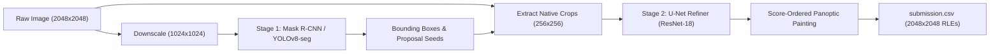

# 🧠 Solar Filament Segmentation: Architecture, SOTA Pipelines & Implementation

---

## 1. 🏗️ Two-Stage Hybrid Architecture (Detector + Crop Refiner)

The top legitimate community architectures (achieving reproducible **LB 0.70**) utilize a two-stage coarse-to-fine segmentation pipeline:



### Stage 1: Global Proposal Detector
* **Model**: Mask R-CNN (ResNet50 FPN v2) / YOLOv8/v11-seg / RF-DETR-Seg.
* **Input Resolution**: Downsampled to $1024 \times 1024$.
* **Goal**: High-recall detection of candidate filament bounding boxes across the full solar disk.

### Stage 2: High-Resolution Local Crop Refiner
* **Model**: ResNet-18 / ResNet-34 Backbone U-Net.
* **Input**: Native-resolution square bounding box crops resized to $256 \times 256$ with context padding ($1.8\times$ bbox extent).
* **Goal**: Exact boundary delineation, barb preservation, and thin spine capture without downsampling blurring.

---

## 2. 🛡️ Essential Post-Processing Algorithms

### A. Score-Ordered Panoptic Painting (Mandatory Non-Overlap Guard)
Under the competition metric, overlapping masks cause submission rejection (`SubmissionStatus.ERROR`).

```python
import numpy as np

def paint_panoptic(candidates, min_area=32, H=2048, W=2048):
    """
    candidates: list of (score: float, binary_mask: np.ndarray uint8 [H, W])
    Returns: list of (score, non_overlapping_mask, area)
    """
    candidates = sorted(candidates, key=lambda x: -x[0])
    claimed = np.zeros((H, W), dtype=np.uint8)
    kept = []
    
    for score, binary in candidates:
        # Subtract already claimed positive pixels
        remaining = binary * (1 - claimed)
        area = int(remaining.sum())
        if area < min_area:
            continue
        claimed |= remaining
        kept.append((score, remaining, area))
        
    return kept
```

### B. Topology-Safe 4-View Flip TTA
Test-time augmentation using Dihedral flips (identity, horizontal flip, vertical flip, combined flip) on $256 \times 256$ refiner crops, guarded by connected-component and area consistency checks:

```python
import cv2
import numpy as np

def select_topology_safe_tta(single_prob, tta_prob, threshold=0.70):
    single_mask = single_prob >= threshold
    tta_mask = tta_prob >= threshold
    single_area = int(single_mask.sum())
    tta_area = int(tta_mask.sum())
    
    if single_area == 0 or tta_area == 0:
        return single_prob
    
    ratio = tta_area / max(single_area, 1)
    if ratio < 0.60 or ratio > 1.70:
        return single_prob # Abort TTA if area shrinks or explodes
    
    # Connected component guard (prevent artificial fragmentation)
    single_comps = cv2.connectedComponents(single_mask.astype(np.uint8), connectivity=8)[0] - 1
    tta_comps = cv2.connectedComponents(tta_mask.astype(np.uint8), connectivity=8)[0] - 1
    if tta_comps > max(single_comps + 1, 2):
        return single_prob
        
    return tta_prob
```

---

## 3. 🎯 Validation Protocol: GroupKFold by Observation Stem

```python
import pandas as pd
from sklearn.model_selection import GroupKFold

# Form observation ID by stripping annotator prefix
# e.g., '040301-20140609195854Bh' -> '20140609195854Bh'
def setup_folds(coco_json_data, n_splits=5):
    records = []
    for img in coco_json_data['images']:
        records.append({
            'record_id': img['id'],
            'file_name': img['file_name'],
            'group_id': img['file_name'].split('.')[0] # Group on physical timestamp
        })
    df = pd.DataFrame(records)
    gkf = GroupKFold(n_splits=n_splits)
    df['fold'] = -1
    for fold, (train_idx, val_idx) in enumerate(gkf.split(df, groups=df['group_id'])):
        df.loc[val_idx, 'fold'] = fold
    return df
```

---

## 4. 🚀 Local Pre-Submission Overlap Validator

Always run this validation check before uploading `submission.csv` to Kaggle:

```python
import numpy as np
import pandas as pd
import pycocotools.mask as mask_utils

def check_submission_integrity(csv_path, H=2048, W=2048):
    df = pd.read_csv(csv_path)
    assert list(df.columns) == ['filament_id', 'segmentation_rle'], "Invalid column headers"
    assert df['filament_id'].is_unique, "Duplicate filament IDs found"
    
    df['stem'] = df['filament_id'].str.rsplit('_', n=1).str[0]
    total_images = df['stem'].nunique()
    
    for stem, group in df.groupby('stem'):
        if len(group) < 2:
            continue
        accumulator = np.zeros((H, W), dtype=np.int16)
        for rle_str in group['segmentation_rle']:
            mask = mask_utils.decode({'size': [H, W], 'counts': rle_str.encode('ascii')}).astype(np.int16)
            accumulator += mask
        if (accumulator > 1).any():
            raise ValueError(f"FAILED: Overlapping instances detected in observation: {stem}")
            
    print(f"PASSED: Validated {len(df)} instances across {total_images} images with zero pixel overlaps.")
```
